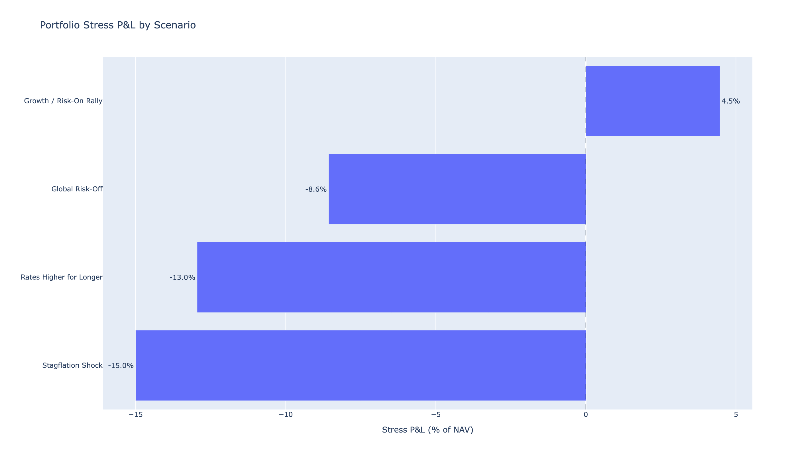
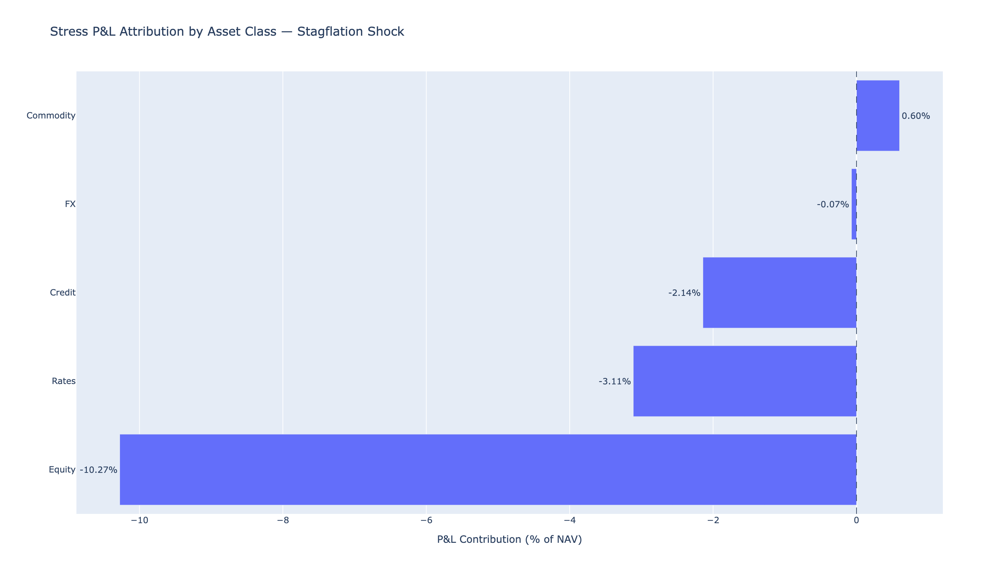
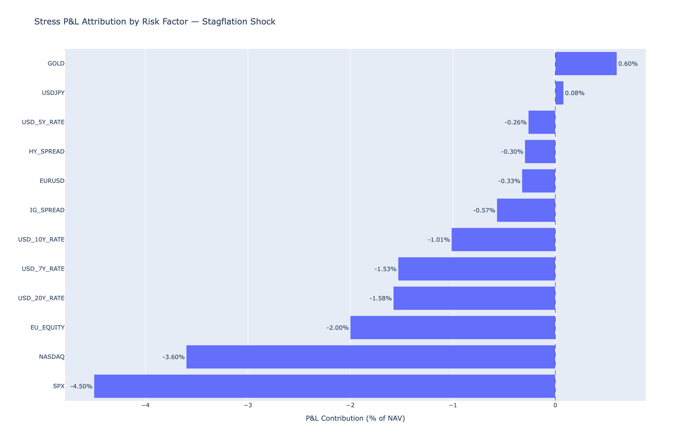
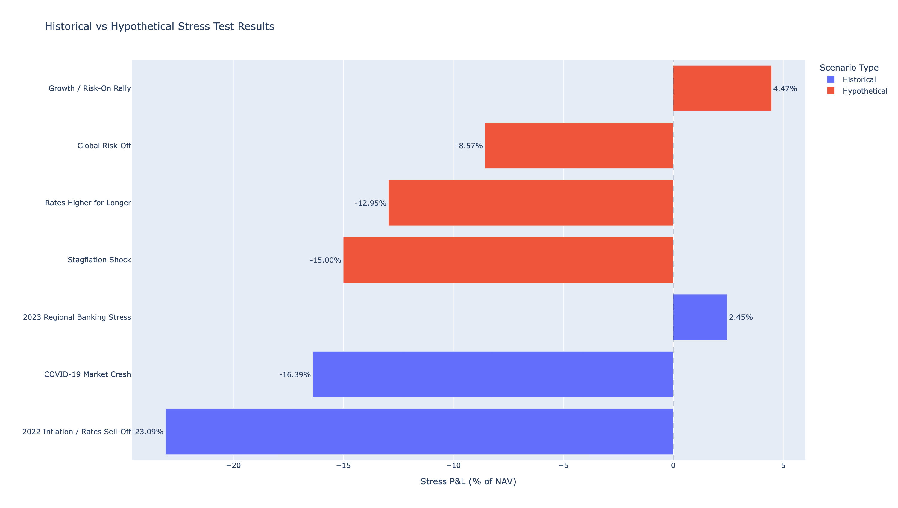
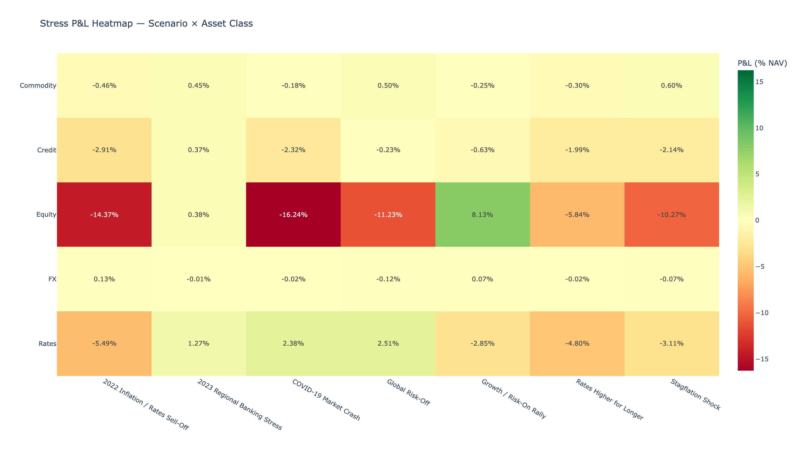

# Market Risk Stress Testing

## Portfolio-Level Stress Testing, P&L Attribution, and Cross-Scenario Risk Profiling

---

## 2. Portfolio Composition and Risk Exposure

### 2.1 Portfolio Overview

The stress-testing framework is applied to a hypothetical multi-asset portfolio with a total net asset value (NAV) of **$100 million**. The portfolio contains ten positions spanning five broad asset classes: Equity, Rates, Credit, Commodity, and Foreign Exchange (FX). The portfolio is designed to provide exposure to several major market risk channels, including equity-market movements, interest-rate changes, credit-spread movements, commodity prices, and foreign-exchange rates.

The portfolio contains $50 million of equity exposure through U.S. and European equity ETFs, $25 million of rates exposure through intermediate- and long-duration U.S. Treasury ETFs, $15 million of credit exposure through investment-grade and high-yield corporate bond ETFs, $5 million of gold exposure, and $5 million of foreign-exchange exposure. Total position exposure therefore equals the portfolio's $100 million NAV.

**Table 1. Portfolio Positions**

| Instrument | Asset Class | Exposure (USD) | % NAV |
|---|---|---:|---:|
| SPY | Equity | $25,000,000 | 25.0% |
| QQQ | Equity | $15,000,000 | 15.0% |
| VGK | Equity | $10,000,000 | 10.0% |
| IEF | Rates | $15,000,000 | 15.0% |
| TLT | Rates | $10,000,000 | 10.0% |
| LQD | Credit | $10,000,000 | 10.0% |
| HYG | Credit | $5,000,000 | 5.0% |
| GLD | Commodity | $5,000,000 | 5.0% |
| EURUSD | FX | $3,000,000 | 3.0% |
| USDJPY | FX | $2,000,000 | 2.0% |
| **Total** |  | **$100,000,000** | **100.0%** |

The portfolio is intentionally multi-asset, but its exposure is not evenly distributed across risk categories. Equity represents the largest allocation at 50% of NAV, followed by Rates at 25%, Credit at 15%, Commodity at 5%, and FX at 5%. This composition provides the foundation for the stress-testing analysis: portfolio outcomes will depend not only on the magnitude of shocks to individual markets, but also on how losses and gains across these asset classes interact under different market regimes.

### 2.2 Asset-Class Allocation

At the asset-class level, the portfolio is concentrated primarily in Equity and Rates, which together account for **75% of NAV**. Credit represents an additional 15%, while Commodity and FX exposures each represent 5%. The resulting allocation is:

- **Equity — 50% of NAV:** The portfolio's largest allocation consists of SPY (25%), QQQ (15%), and VGK (10%). These positions provide exposure to broad U.S. equities, technology-oriented U.S. equities, and European equities, respectively. Equity therefore represents the portfolio's principal source of directional growth-market exposure.

- **Rates — 25% of NAV:** IEF (15%) and TLT (10%) provide exposure to intermediate- and long-duration U.S. Treasury securities. These positions introduce sensitivity to changes in U.S. interest rates. Because TLT has greater duration than IEF, its price response to a given yield shock is expected to be larger.

- **Credit — 15% of NAV:** LQD (10%) and HYG (5%) provide investment-grade and high-yield corporate credit exposure. Unlike pure Treasury positions, these instruments are exposed to both underlying interest-rate movements and changes in corporate credit spreads. Credit stress can therefore arise from multiple risk channels simultaneously.

- **Commodity — 5% of NAV:** GLD represents the portfolio's gold exposure. Gold is modeled as a direct-return risk factor and provides a potential source of diversification because its behavior can differ from that of equities, rates, and corporate credit across market regimes.

- **FX — 5% of NAV:** EURUSD (3%) and USDJPY (2%) represent the portfolio's foreign-exchange exposures. These positions introduce sensitivity to movements in the euro and Japanese yen relative to the U.S. dollar. Given their relatively small portfolio weights, their direct contribution to total portfolio stress is expected to be smaller than that of Equity, Rates, or Credit, although their direction of contribution can vary across scenarios.

This allocation creates an important distinction between **portfolio weight** and **portfolio risk**. An asset class with a large NAV allocation does not necessarily generate a proportionally large stress loss, while a smaller position can become important if it has high sensitivity to the shocked risk factor. For fixed-income instruments in particular, duration and spread sensitivity influence stress P&L in addition to the size of the underlying exposure.

The portfolio should therefore be viewed not simply as a set of asset-class weights, but as a collection of exposures to different underlying market risk factors. The mapping between individual positions and those risk factors is presented in the following subsection.

### 2.3 Risk-Factor Mapping

The hypothetical stress-testing framework translates each portfolio position into one or more underlying market risk factors. This mapping allows scenario shocks to be specified at the risk-factor level and subsequently translated into position-level and portfolio-level stressed P&L.

Three broad types of risk-factor exposure are modeled:

1. **Direct-return factors**, where the scenario shock is applied directly as a percentage return to the associated position.
2. **Interest-rate factors**, where changes in yields affect fixed-income positions through modified duration.
3. **Credit-spread factors**, where changes in corporate credit spreads affect credit positions through spread duration.

**Table 2. Instrument-to-Risk-Factor Mapping**

| Instrument | Asset Class | Risk Factor(s) | Risk-Factor Type |
|---|---|---|---|
| SPY | Equity | SPX | Direct return |
| QQQ | Equity | NASDAQ | Direct return |
| VGK | Equity | EU_EQUITY, EURUSD | Direct return |
| IEF | Rates | USD_7Y_RATE | Interest rate |
| TLT | Rates | USD_20Y_RATE | Interest rate |
| LQD | Credit | USD_10Y_RATE, IG_SPREAD | Interest rate + credit spread |
| HYG | Credit | USD_5Y_RATE, HY_SPREAD | Interest rate + credit spread |
| GLD | Commodity | GOLD | Direct return |
| EURUSD | FX | EURUSD | Direct return |
| USDJPY | FX | USDJPY | Direct return |

For most Equity, Commodity, and FX positions, the mapping is direct. The model generally assumes a unit sensitivity of 1.0 between each instrument and its designated primary risk factor. For example, a shock to the SPX factor is transmitted to SPY, while a shock to GOLD is transmitted to GLD. VGK is modeled with two sources of risk: a primary sensitivity of 1.0 to European equities (EU_EQUITY) and an additional sensitivity of 0.35 to EURUSD. This allows the hypothetical framework to capture a partial foreign-exchange effect alongside the underlying European equity-market shock. The magnitude of the resulting position return depends on the scenario shock and the position's assigned sensitivity to the relevant risk factor.

Rates positions are mapped to representative points on the U.S. Treasury yield curve. IEF is associated with the USD 7-year rate factor, while TLT is associated with the USD 20-year rate factor. Their stressed price changes are estimated using modified duration, so a given change in yield does not translate directly into an equal percentage change in price.

Credit positions require a two-factor representation. LQD is exposed to both the USD 10-year interest-rate factor and the investment-grade credit-spread factor, while HYG is exposed to the USD 5-year interest-rate factor and the high-yield credit-spread factor. The total stressed P&L of each credit position therefore reflects the combined contribution of interest-rate and spread movements.

This structure allows the hypothetical stress framework to distinguish between different economic sources of loss even when they affect the same instrument. For example, a corporate bond ETF may lose value because Treasury yields rise, because credit spreads widen, or because both occur simultaneously. The position-level P&L can therefore be decomposed into individual risk-factor contributions before being aggregated to the asset-class and portfolio levels.

The mapping can be summarized as:

**Scenario Shock → Risk Factor → Position P&L → Asset-Class P&L → Portfolio P&L**

This risk-factor mapping is specific to the hypothetical stress-testing framework. Historical stress testing does not require the same factor mapping because it applies observed historical returns directly to each portfolio instrument.

### 2.4 Fixed-Income Sensitivity Assumptions

Fixed-income positions require additional sensitivity parameters because their stressed returns cannot be represented adequately by applying interest-rate or credit-spread shocks as direct percentage price changes. The hypothetical stress framework therefore uses **modified duration** for interest-rate risk and **spread duration** for credit-spread risk.

#### Modified Duration

Modified duration measures the approximate percentage change in the price of a fixed-income instrument for a change in its underlying yield. For a small change in yield, the first-order relationship is:

$$
\frac{\Delta P}{P}
\approx
-D_{\mathrm{mod}}\Delta y
$$

where:

- $P$ is the instrument price;
- $D_{\mathrm{mod}}$ is modified duration;
- $\Delta y$ is the change in yield, expressed in decimal form.

The negative sign reflects the inverse relationship between bond prices and yields. An increase in yield produces an estimated decline in price, while a decrease in yield produces an estimated increase in price.

For example, an instrument with a modified duration of 8 would experience an approximate price change of:

$$
-8 \times 0.01 = -8\%
$$

for a 100-basis-point increase in its underlying yield, before incorporating any additional sensitivity scaling used by the stress model.

#### Spread Duration

Corporate credit positions are exposed not only to changes in Treasury yields but also to changes in credit spreads. Spread duration approximates the percentage price response to a change in the relevant credit spread:

$$
\frac{\Delta P}{P}
\approx
-SD\Delta s
$$

where:

- $SD$ is spread duration;
- $\Delta s$ is the change in credit spread, expressed in decimal form.

A widening of credit spreads therefore produces a negative price effect, while spread tightening produces a positive price effect.

In this portfolio, LQD and HYG contain both interest-rate and credit-spread exposure. Their hypothetical stressed P&L can therefore be decomposed into two separate channels:

**Credit Position Stress = Interest-Rate Contribution + Credit-Spread Contribution**

This decomposition is important because the two components need not move in the same direction. In a conventional risk-off environment, falling Treasury yields may partially offset losses caused by widening credit spreads. In an inflationary stress, rising Treasury yields and widening credit spreads may instead generate losses simultaneously.

**Table 3. Fixed-Income Sensitivity Assumptions**

| Instrument | Asset Class | Rate Factor | Modified Duration | Spread Factor | Spread Duration |
|---|---|---|---:|---|---:|
| IEF | Rates | USD_7Y_RATE | 7.3 | — | — |
| TLT | Rates | USD_20Y_RATE | 15.8 | — | — |
| LQD | Credit | USD_10Y_RATE | 8.1 | IG_SPREAD | 7.6 |
| HYG | Credit | USD_5Y_RATE | 3.5 | HY_SPREAD | 3.3 |

The duration parameters are treated as **static model inputs** for the purpose of the stress analysis. They are not dynamically calculated from the underlying bond cash flows or ETF holdings during each scenario. This approach keeps the stress framework transparent and allows the contribution of interest-rate and spread shocks to be isolated clearly.

The duration-based approach is a first-order approximation. It does not incorporate convexity or other nonlinear effects that may become material under sufficiently large yield or spread movements. These limitations are discussed further in Section 8.

In addition to duration, the hypothetical stress framework applies position-specific risk-factor sensitivities when translating scenario shocks into stressed P&L. These sensitivities are specified as model assumptions rather than estimated through statistical calibration. The distinction between scenario shocks, sensitivities, and duration parameters is developed formally in the stress-testing methodology in Section 3.

## 3. Stress Testing Methodology

### 3.1 Stress Testing Framework

The stress-testing framework evaluates the portfolio under two complementary approaches: **hypothetical stress testing** and **historical stress testing**. Both approaches estimate the impact of adverse market conditions on the portfolio's current exposures, but they differ in how the stressed market movements are defined and transmitted to individual positions.

**Hypothetical stress testing** begins with a predefined set of shocks to underlying market risk factors. These shocks represent economically coherent but deliberately constructed market environments, such as a global risk-off event, a stagflation shock, or a sustained increase in interest rates. Each risk-factor shock is translated into position-level P&L using the instrument's assigned sensitivity and, where applicable, modified duration or spread duration. The resulting factor contributions are then aggregated from the risk-factor level to the position, asset-class, and portfolio levels.

The hypothetical framework therefore follows the structure:

**Scenario → Risk-Factor Shocks → Position Sensitivities → Position P&L → Portfolio P&L**

**Historical stress testing**, by contrast, does not specify risk-factor shocks or sensitivities. Instead, it measures the actual returns experienced by the portfolio's instruments over selected historical stress windows and applies those observed returns to the portfolio's current exposures. The approach therefore asks how the current portfolio would perform if the selected historical pattern of market movements were replayed.

The historical framework follows:

**Historical Stress Window → Observed Instrument Returns → Current Position Exposures → Position P&L → Portfolio P&L**

The two approaches provide different but complementary perspectives on portfolio risk. Hypothetical scenarios provide greater control over the economic structure of a stress event and allow losses to be decomposed into individual modeled risk factors. Historical scenarios preserve the joint market behavior observed during actual periods of stress, including relationships across asset classes that do not need to be specified individually by the model.

Neither approach should be interpreted as a forecast of future portfolio performance. Rather, each represents a conditional analysis of the portfolio under a particular stressed market environment. Hypothetical stress asks **"What would happen if these specified risk-factor shocks occurred?"**, while historical stress asks **"What would happen to today's portfolio if these observed historical market movements were repeated?"**

Using both approaches reduces reliance on a single view of stress. Hypothetical scenarios can examine economically relevant conditions that may not correspond exactly to a past episode, while historical scenarios provide an empirical reference based on realized market behavior. Their combined use therefore provides a broader basis for assessing portfolio vulnerabilities, loss concentration, and diversification behavior across different market regimes.

### 3.2 Hypothetical Stress Methodology

The hypothetical stress-testing framework estimates portfolio P&L by applying predefined scenario shocks to the risk factors mapped to each position. For position $i$ and risk factor $f$, the stressed P&L contribution depends on four components: the position exposure, the scenario shock, the assigned factor sensitivity, and, for fixed-income exposures, the relevant duration measure.

Let:

- $E_i$ = USD exposure of position $i$;
- $\beta_{i,f}$ = sensitivity of position $i$ to risk factor $f$;
- $\Delta F_f$ = direct-return shock to risk factor $f$;
- $D_i$ = modified duration of position $i$;
- $SD_i$ = spread duration of position $i$;
- $\Delta y_f$ = interest-rate shock for factor $f$;
- $\Delta s_f$ = credit-spread shock for factor $f$.

All percentage-return shocks are represented in decimal form. Interest-rate and credit-spread shocks are also converted to decimal yield or spread changes before entering the duration-based calculations. For example, a 100-basis-point increase corresponds to:

$$
100 \text{ bps} = 0.01
$$

#### 3.2.1 Direct-Return Risk Factors

For direct-return factors, stressed P&L is calculated by applying the specified percentage shock to the position exposure, adjusted by the assigned factor sensitivity:

$$
\mathrm{PnL}_{i,f} = E_i \times \beta_{i,f} \times \Delta F_f
$$

This methodology is used for the modeled Equity, Commodity, and FX factors, including `SPX`, `NASDAQ`, `EU_EQUITY`, `GOLD`, `EURUSD`, and `USDJPY`.

For example, if a $25 million SPY position has a sensitivity of 1.0 to the SPX factor and the scenario specifies a -20% SPX shock:

$$
\mathrm{PnL}_{\mathrm{SPY}} = 25{,}000{,}000 \times 1.0 \times (-0.20) = -5{,}000{,}000
$$

The resulting stress loss is **$5.0 million**.

The same framework accommodates partial factor sensitivity. VGK, for example, has a primary sensitivity of 1.0 to `EU_EQUITY` and an additional sensitivity of 0.35 to `EURUSD`. Its total hypothetical P&L is therefore the sum of the contributions generated by both factors.

#### 3.2.2 Interest-Rate Risk Factors

For interest-rate exposures, the framework uses a first-order modified-duration approximation. The factor-level P&L is estimated as:

$$
\mathrm{PnL}_{i,f} \approx -E_i \times D_i \times \beta_{i,f} \times \Delta y_f
$$

The negative sign captures the inverse relationship between bond prices and yields. A positive yield shock therefore generates a negative estimated P&L, while a decline in yields generates a positive estimated P&L.

For example, consider the $10 million TLT position with a modified duration of 15.8 and a sensitivity of 1.0 to the USD 20-year rate factor. Under a hypothetical 100-basis-point increase in the 20-year yield:

$$
\mathrm{PnL}_{\mathrm{TLT}} \approx -10{,}000{,}000 \times 15.8 \times 1.0 \times 0.01 = -1{,}580{,}000
$$

The resulting estimated stress loss is **$1.58 million**.

The same methodology is applied to IEF and to the interest-rate components of LQD and HYG using their respective rate factors and modified-duration assumptions.

#### 3.2.3 Credit-Spread Risk Factors

Credit instruments are additionally exposed to changes in corporate credit spreads. The spread component of stressed P&L is estimated using spread duration:

$$
\mathrm{PnL}_{i,f} \approx -E_i \times SD_i \times \beta_{i,f} \times \Delta s_f
$$

A positive spread shock represents spread widening and therefore produces a negative price effect. Spread tightening produces the opposite result.

Because LQD and HYG are exposed to both interest-rate and credit-spread factors, their total stressed P&L combines the two effects. For a credit position $i$:

$$
\mathrm{PnL}_i = \mathrm{PnL}_{i,\mathrm{rate}} + \mathrm{PnL}_{i,\mathrm{spread}}
$$

This allows the framework to distinguish between losses caused by movements in the underlying Treasury curve and losses caused by changes in credit risk premia.

#### 3.2.4 Position and Portfolio Aggregation

A position may be exposed to one or more modeled risk factors. Its total stressed P&L is calculated by summing all factor-level contributions:

$$
\mathrm{PnL}_i = \sum_f \mathrm{PnL}_{i,f}
$$

The position's stressed return is then:

$$
R_i^{\mathrm{stress}} = \frac{\mathrm{PnL}_i}{E_i}
$$

Portfolio-level stressed P&L is obtained by aggregating across all positions:

$$
\mathrm{PnL}_{\mathrm{portfolio}} = \sum_i \mathrm{PnL}_i
$$

To make scenario severity directly comparable across scenarios and asset classes, portfolio P&L is also expressed as a percentage of portfolio NAV:

$$
\mathrm{PnL}_{\mathrm{NAV}} =
\frac{\mathrm{PnL}_{\mathrm{portfolio}}}{\mathrm{NAV}}
\times 100
$$

where $\mathrm{PnL}_{\mathrm{NAV}}$ denotes stressed portfolio P&L expressed as a percentage of NAV.

With a portfolio NAV of $100 million, a stress loss of $15 million therefore corresponds to:

$$
\frac{-15{,}000{,}000}{100{,}000{,}000} \times 100 = -15.0
$$

Therefore, the portfolio stress loss is **-15.0% of NAV**.

The same normalization is applied to position-level, asset-class, and risk-factor contributions when they are reported as percentages of NAV.

#### 3.2.5 Hypothetical P&L Attribution

Because hypothetical stress is calculated initially at the risk-factor level, the resulting portfolio loss can be decomposed through several analytical layers:

**Risk-Factor P&L → Position P&L → Asset-Class P&L → Portfolio P&L**

Risk-factor attribution identifies the modeled economic shocks responsible for the result. Position attribution identifies the individual instruments through which those shocks affect the portfolio, while asset-class attribution aggregates the same P&L into broader portfolio risk categories.

This decomposition is additive. Subject to rounding, the same total portfolio P&L is recovered whether the result is aggregated by risk factor, position, or asset class:

**Sum of Risk-Factor P&L = Sum of Position P&L = Sum of Asset-Class P&L = Portfolio P&L**

In other words, the different attribution views represent alternative decompositions of the same portfolio-level stress result rather than separate sources of P&L.

The hypothetical scenario shocks and factor sensitivities used in this framework are deterministic model inputs. The primary risk-factor sensitivities are generally set to 1.0, with VGK additionally assigned a 0.35 sensitivity to EURUSD. These sensitivities are not statistically calibrated to historical factor relationships or estimated betas. Consequently, the hypothetical stress results should be interpreted as conditional scenario estimates under the specified assumptions rather than as forecasts or probabilistic loss estimates.

### 3.3 Historical Stress Methodology

Historical stress testing evaluates how the current portfolio would have performed under market movements observed during selected historical periods of stress. Unlike the hypothetical framework, historical stress does not construct shocks at the risk-factor level. Instead, it measures the realized return of each portfolio instrument over a predefined historical window and applies that return directly to the instrument's current exposure.

This approach preserves the cross-asset market movements that occurred during the selected episode and provides an empirical complement to the assumption-driven hypothetical scenarios.

#### 3.3.1 Historical Scenario Definition

Each historical scenario is defined by a start date and an end date corresponding to a selected period of market stress. The framework evaluates three historical episodes:

- COVID-19 Market Crash;
- 2022 Inflation / Rates Sell-Off;
- 2023 Regional Banking Stress.

For each scenario, historical market prices are obtained for the instruments represented in the portfolio. The same current portfolio exposures are used across all historical scenarios, so differences in stressed P&L reflect differences in the historical market movements rather than changes in portfolio composition.

The historical framework therefore represents a replay analysis:

**Historical Stress Window → Observed Instrument Returns → Current Portfolio Exposures → Stress P&L**

#### 3.3.2 Historical Return and P&L Calculation

For instrument $i$, the historical return over scenario window $h$ is calculated from its observed market prices:

$$
R_{i,h} = \frac{P_{i,h}^{end}}{P_{i,h}^{start}} - 1
$$

where:

- $R_{i,h}$ is the historical return of instrument $i$ during scenario $h$;
- $P_{i,h}^{start}$ is the instrument price at the beginning of the historical window;
- $P_{i,h}^{end}$ is the instrument price at the end of the historical window.

The observed historical return is then applied directly to the current USD exposure of the position:

$$
\mathrm{PnL}_{i,h} = E_i \times R_{i,h}
$$

where $E_i$ is the current USD exposure of position $i$.

For example, if a position currently has an exposure of $25 million and its instrument experienced a -30% return during the selected historical window:

$$
\mathrm{PnL} = 25{,}000{,}000 \times (-0.30) = -7{,}500{,}000
$$

The resulting historical stress loss is **$7.5 million**.

The calculation therefore answers a counterfactual question: how would the portfolio's current exposures perform if the instrument-level market movements observed during the historical episode were repeated?

#### 3.3.3 Portfolio Aggregation and Attribution

Historical position-level P&L is aggregated to obtain total portfolio stress P&L:

$$
\mathrm{PnL}_{portfolio,h} = \sum_i \mathrm{PnL}_{i,h}
$$

As in the hypothetical framework, the portfolio result is normalized by current portfolio NAV:

$$
\frac{\mathrm{PnL}_{portfolio,h}}{NAV} \times 100
$$

This expresses historical portfolio P&L as a percentage of NAV for scenario $h$.

Position-level results can also be aggregated by asset class:

$$
\mathrm{PnL}_{a,h} = \sum_{i \in a} \mathrm{PnL}_{i,h}
$$

where $a$ denotes an asset class.

The resulting decomposition therefore follows:

**Observed Instrument Returns → Position P&L → Asset-Class P&L → Portfolio P&L**

Historical stress attribution is reported at the position and asset-class levels. Risk-factor attribution is not applied to historical scenarios because the framework directly uses realized instrument returns rather than decomposing those returns into modeled factor shocks. This distinction preserves the methodological separation between the historical and hypothetical approaches.

#### 3.3.4 Interpretation of Historical Stress

Historical stress results should be interpreted as conditional replay estimates rather than forecasts. They show the estimated effect on the current portfolio if the selected historical pattern of instrument returns were repeated, holding current portfolio exposures constant.

A key advantage of this approach is that the historical returns jointly reflect market relationships that actually occurred during the selected episode. For example, a historical stress period may simultaneously contain equity declines, changes in Treasury prices, credit-market repricing, currency movements, and changes in commodity prices. These relationships are captured through the observed instrument returns without requiring the model to specify each relationship separately.

Historical replay nevertheless depends on the selected scenario window. Different start and end dates can materially change measured returns and therefore estimated portfolio losses. In addition, a past episode does not necessarily represent the structure or severity of a future crisis. Historical stress should therefore be viewed as an empirical reference scenario rather than a complete representation of the portfolio's possible future loss distribution.

Used together, the historical and hypothetical methodologies provide complementary information: historical stress anchors the analysis in realized market behavior, while hypothetical stress allows specific economic shocks and risk-factor relationships to be examined explicitly.

### 3.4 Scenario Design and Selection

The stress-testing framework contains seven scenarios: four hypothetical scenarios and three historical scenarios. The scenario set is designed to expose the portfolio to materially different sources of market risk rather than variations of a single adverse environment. Together, the scenarios examine equity drawdowns, interest-rate shocks, credit-spread widening, inflationary pressure, safe-haven behavior, and changes in cross-asset diversification.

The scenarios are not assigned probabilities. Their purpose is to evaluate the conditional behavior of the current portfolio under a range of economically distinct market environments.

#### 3.4.1 Hypothetical Scenario Design

Four hypothetical scenarios are used in the analysis:

**Table 4. Hypothetical Scenario Set**

| Scenario | Primary Stress Theme | Key Risk Channels | Intended Portfolio Test |
|---|---|---|---|
| Global Risk-Off | Broad deterioration in investor risk appetite | Equity declines, credit-spread widening, safe-haven rate and gold behavior, FX movements | Tests portfolio performance during a conventional flight-to-quality environment |
| Stagflation Shock | Weak growth combined with persistent inflation | Equity losses, higher interest rates, wider credit spreads, commodity and FX movements | Tests vulnerability when both growth-sensitive and duration-sensitive assets are under pressure |
| Rates Higher for Longer | Persistent upward pressure on interest rates | Treasury yield increases, duration losses, credit repricing, pressure on rate-sensitive equities | Tests sensitivity to sustained restrictive monetary conditions |
| Growth / Risk-On Rally | Improving growth and investor risk appetite | Equity gains, higher yields, credit-spread tightening, weaker defensive assets | Tests upside participation and the behavior of defensive positions in a favorable risk environment |

The hypothetical scenarios are designed at the risk-factor level. Each scenario specifies shocks to the factors relevant to the portfolio, including equity indices, Treasury rates, credit spreads, foreign-exchange rates, and gold. These shocks are then transmitted to positions using the methodology described in Section 3.2.

The scenarios are intentionally differentiated in their economic structure. Global Risk-Off represents a more conventional defensive market regime in which risky assets decline while high-quality duration and gold can provide offsets. Stagflation Shock is designed to challenge this diversification mechanism by combining equity weakness with rising rates and wider credit spreads. Rates Higher for Longer isolates the portfolio's vulnerability to sustained interest-rate pressure, while Growth / Risk-On Rally provides a positive scenario that tests whether the portfolio participates in improving risk sentiment and identifies which defensive exposures become performance drags.

Including a positive scenario is useful because stress analysis need not be restricted to portfolio losses. Examining the portfolio under a risk-on environment provides additional information about asymmetry, diversification, and the opportunity cost of defensive exposures.

The hypothetical shock magnitudes are deterministic scenario assumptions rather than forecasts or statistically estimated tail events. They are selected to create economically interpretable stress environments and should therefore be evaluated as conditional model inputs.

#### 3.4.2 Historical Scenario Selection

Three historical episodes are used to complement the hypothetical scenarios:

**Table 5. Historical Scenario Set**

| Scenario | Stress Window | Primary Market Theme | Intended Portfolio Test |
|---|---|---|---|
| COVID-19 Market Crash | 19 Feb 2020 – 23 Mar 2020 | Rapid global risk-asset sell-off and flight to safety | Tests the portfolio against an extreme growth and liquidity shock |
| 2022 Inflation / Rates Sell-Off | 3 Jan 2022 – 14 Oct 2022 | Inflation shock, aggressive monetary tightening, and simultaneous equity/bond weakness | Tests the portfolio in an environment where traditional equity-rate diversification weakened |
| 2023 Regional Banking Stress | 8 Mar 2023 – 24 Mar 2023 | Banking-sector stress accompanied by falling rates and defensive asset demand | Tests portfolio behavior during a financial-sector shock with offsetting performance across asset classes |

These episodes were selected because they represent distinct forms of realized market stress. The COVID-19 episode captures a rapid and severe risk-off shock. The 2022 episode captures an inflation-driven regime in which equities and fixed income experienced substantial simultaneous losses. The 2023 regional banking episode provides a different stress structure in which declines in interest rates and gains in defensive assets could offset weakness elsewhere in the portfolio.

The selected windows are applied consistently across the instruments in each historical scenario. Historical returns are measured over each specified window and then applied to the portfolio's current exposures using the methodology described in Section 3.3.

#### 3.4.3 Complementarity of the Scenario Set

The seven scenarios are designed to provide complementary rather than redundant information. In particular, the scenario set allows the portfolio to be examined under several different relationships between equity and interest-rate risk.

A conventional risk-off environment can produce:

$$
\mathrm{Equity\ Losses}
+
\mathrm{Rate\ Gains}
$$

while an inflationary or stagflationary environment can instead produce:

$$
\mathrm{Equity\ Losses}
+
\mathrm{Rate\ Losses}
$$

This distinction is particularly important for the portfolio because Equity and Rates represent its two largest asset-class allocations. The effectiveness of fixed-income exposure as a portfolio diversifier therefore depends materially on the economic structure of the stress event.

The historical and hypothetical scenarios also provide useful points of comparison. The 2022 Inflation / Rates Sell-Off offers a realized example of simultaneous equity and fixed-income weakness, while the hypothetical Stagflation Shock and Rates Higher for Longer scenarios examine related vulnerabilities under explicitly defined factor shocks. Conversely, the historical COVID-19 and Regional Banking Stress episodes provide examples in which falling rates can support fixed-income positions during periods of market stress.

The scenario framework therefore evaluates not only the magnitude of portfolio losses, but also how the sources of those losses and the effectiveness of diversification change across different market environments.

## 4. Hypothetical Stress Testing Results

### 4.1 Portfolio-Level Scenario Results

The four hypothetical scenarios produce materially different portfolio outcomes, reflecting differences in the direction and combination of equity, interest-rate, credit-spread, commodity, and foreign-exchange shocks. Of the four scenarios, Stagflation Shock generates the largest portfolio loss, followed by Rates Higher for Longer and Global Risk-Off. Growth / Risk-On Rally produces a positive portfolio result.

**Table 6. Hypothetical Stress Scenario Results**

| Scenario | Portfolio Stress P&L | P&L (% NAV) |
|---|---:|---:|
| Stagflation Shock | -$15,000,000 | -15.00% |
| Rates Higher for Longer | -$12,950,500 | -12.95% |
| Global Risk-Off | -$8,570,500 | -8.57% |
| Growth / Risk-On Rally | $4,466,500 | 4.47% |

**Figure 1. Hypothetical Scenario Stress Comparison**

The **Stagflation Shock** is the most severe hypothetical scenario, producing a loss of $15.0 million, or **15.00% of NAV**. The severity of this scenario reflects simultaneous adverse movements across several major portfolio exposures. Equity positions decline substantially, while rising interest rates generate losses on Treasury and credit positions and wider credit spreads create an additional source of pressure. Although gold provides a positive contribution, the offset is small relative to the combined losses from Equity, Rates, and Credit.

The **Rates Higher for Longer** scenario produces the second-largest hypothetical loss at approximately $13.0 million, or **12.95% of NAV**. In this scenario, the portfolio is affected by both direct equity weakness and substantial duration-related losses. Long-duration fixed-income exposure becomes particularly important because rising yields reduce the value of Treasury and investment-grade credit positions. The scenario demonstrates that the portfolio's Rates allocation can become a material source of downside when the direction of the interest-rate shock is adverse.

The **Global Risk-Off** scenario produces a smaller but still significant loss of approximately $8.6 million, or **8.57% of NAV**. Equity losses are severe in this scenario, but they are partially offset by gains in Treasury positions and gold. This result illustrates a more conventional flight-to-quality environment in which defensive exposures provide meaningful diversification against falling risk assets.

The **Growth / Risk-On Rally** scenario generates a gain of approximately $4.5 million, or **4.47% of NAV**. Strong equity performance more than offsets losses from Treasury duration, credit positions, and gold. The positive result confirms that the portfolio retains meaningful upside participation through its 50% Equity allocation, while also illustrating the opportunity cost of defensive positions when growth expectations and risk appetite improve.

Taken together, the scenario results show that portfolio outcomes depend not only on the severity of individual market shocks, but also on whether major asset classes reinforce or offset one another. The contrast between Stagflation Shock and Global Risk-Off is particularly important: both contain substantial equity weakness, but their portfolio losses differ because the Rates allocation behaves in opposite directions. This cross-asset interaction is examined more directly through asset-class attribution in the following subsection.

### 4.2 Cross-Scenario Asset-Class Attribution

Portfolio-level stress results can be decomposed by asset class to identify which exposures drive losses and which provide diversification benefits under each hypothetical scenario. Table 7 presents each asset class's contribution to portfolio P&L as a percentage of NAV.

**Table 7. Hypothetical Asset-Class Attribution (% NAV)**

| Asset Class | Global Risk-Off | Stagflation Shock | Rates Higher for Longer | Growth / Risk-On Rally |
|---|---:|---:|---:|---:|
| Equity | -11.23% | -10.27% | -5.84% | 8.12% |
| Rates | 2.51% | -3.11% | -4.80% | -2.85% |
| Credit | -0.23% | -2.14% | -1.99% | -0.63% |
| Commodity | 0.50% | 0.60% | -0.30% | -0.25% |
| FX | -0.12% | -0.07% | -0.02% | 0.07% |
| **Portfolio** | **-8.57%** | **-15.00%** | **-12.95%** | **4.47%** |

The attribution results show that **Equity is the dominant source of directional portfolio risk across the hypothetical scenarios**. Equity contributes a loss of 11.23% of NAV under Global Risk-Off and 10.27% under Stagflation Shock. Even under Rates Higher for Longer, where fixed-income losses become particularly important, Equity remains the largest individual asset-class loss at 5.84% of NAV. Conversely, the Growth / Risk-On Rally produces an 8.12% positive Equity contribution, demonstrating that the same concentration that creates substantial downside exposure also provides the portfolio's primary source of upside participation.

The behavior of the **Rates allocation is strongly regime-dependent**. Under Global Risk-Off, Rates contribute a positive 2.51% of NAV and materially offset the Equity drawdown. This reflects the assumed decline in Treasury yields during a flight-to-quality environment. Under Stagflation Shock and Rates Higher for Longer, however, Rates contribute losses of 3.11% and 4.80% of NAV, respectively. In these environments, rising yields cause the portfolio's duration exposure to reinforce rather than offset losses elsewhere.

This difference can be summarized as:

$$
\mathrm{Global\ Risk\text{-}Off:}
\qquad
\mathrm{Equity}\downarrow
+
\mathrm{Rates}\uparrow
$$

compared with:

$$
\mathrm{Stagflation/Rates\ Stress:}
\qquad
\mathrm{Equity}\downarrow
+
\mathrm{Rates}\downarrow
$$

The contrast demonstrates that the diversification benefit of Treasury exposure is conditional on the underlying economic regime. Rates provide meaningful protection when market stress is accompanied by falling yields, but they become an additional source of loss when inflation or monetary tightening pushes yields higher.

**Credit** contributes negatively in all four hypothetical scenarios, although the magnitude varies substantially. The largest Credit losses occur under Stagflation Shock (-2.14% of NAV) and Rates Higher for Longer (-1.99%), where interest-rate pressure combines with adverse credit-spread movements. Under Global Risk-Off, the Credit loss is much smaller at 0.23% of NAV because gains from declining underlying Treasury yields partially offset the effect of wider credit spreads. The Growth / Risk-On Rally also produces a modest Credit loss of 0.63% of NAV because the benefit from spread tightening is insufficient to offset the negative impact of higher underlying rates within the specified scenario.

**Commodity exposure**, represented by gold, provides a positive contribution under both Global Risk-Off and Stagflation Shock, adding 0.50% and 0.60% of NAV, respectively. These gains provide diversification but remain small relative to the portfolio's Equity, Rates, and Credit exposures because Commodity represents only 5% of NAV. Gold therefore acts as a partial offset rather than a sufficient hedge against broad portfolio losses. Under Rates Higher for Longer and Growth / Risk-On Rally, Commodity contributes modest losses.

**FX exposure** has the smallest direct portfolio impact across the four scenarios, with contributions ranging from -0.12% to 0.07% of NAV. This reflects both the relatively small 5% direct FX allocation and the specified scenario shocks. FX nevertheless contributes to the overall decomposition and also affects VGK through its additional 0.35 sensitivity to EURUSD.

Overall, the asset-class attribution demonstrates that the severity of a hypothetical stress scenario is determined by the **interaction of major portfolio exposures**, rather than by Equity losses alone. Global Risk-Off contains the largest Equity loss of the four scenarios, yet it does not generate the largest portfolio loss because Rates and Commodity provide positive offsets. Stagflation Shock is more damaging because losses occur simultaneously across Equity, Rates, and Credit, substantially weakening the portfolio's diversification structure.

This simultaneous deterioration across major asset classes explains why Stagflation Shock is the most severe hypothetical scenario and motivates a more detailed decomposition of its $15.0 million portfolio loss in the following subsections.

### 4.3 Stagflation Shock: Asset-Class Decomposition

Stagflation Shock produces the most severe result among the four hypothetical scenarios, generating a portfolio loss of **$15.0 million, or 15.00% of NAV**. Unlike a conventional risk-off scenario in which falling interest rates may offset weakness in risky assets, the Stagflation Shock generates simultaneous losses across the portfolio's three largest asset classes: Equity, Rates, and Credit.

**Figure 2. Stagflation Shock — Asset-Class P&L Attribution**

The -15.00% portfolio loss can be decomposed as:

**Equity (-10.27%) + Rates (-3.11%) + Credit (-2.14%) + FX (-0.07%) + Commodity (+0.60%) = Portfolio (-15.00%)**

Equity is the dominant source of loss, contributing approximately **-$10.28 million, or -10.27% of NAV**. This represents more than two-thirds of the gross negative contribution before diversification offsets and reflects losses across SPY, QQQ, and VGK. Given that Equity represents 50% of portfolio NAV, the result confirms that the portfolio's largest allocation is also its primary source of downside under the scenario.

Rates generate the second-largest asset-class loss at approximately **-$3.11 million, or -3.11% of NAV**. Both IEF and TLT are negatively affected by the assumed increase in Treasury yields. The contribution is particularly important from a portfolio-risk perspective because the Rates allocation does not provide the defensive offset that it provides under Global Risk-Off. Instead, duration exposure reinforces the Equity drawdown.

Credit contributes an additional **-$2.14 million, or -2.14% of NAV**. The loss reflects the combined effect of higher underlying Treasury yields and wider corporate credit spreads on LQD and HYG. The presence of both risk channels makes Credit another source of reinforcing downside rather than a source of diversification.

FX contributes a comparatively small loss of approximately **-$70,000, or -0.07% of NAV**. Its portfolio-level effect is limited relative to the three major loss-producing asset classes.

Commodity is the only asset class to provide a meaningful positive contribution. The GLD position generates a gain of **$600,000, or 0.60% of NAV**, partially offsetting losses elsewhere in the portfolio. However, because Commodity represents only 5% of NAV, the positive contribution is insufficient to materially change the overall stress outcome.

The Stagflation result therefore illustrates a form of **cross-asset loss concentration**. The severity of the scenario does not arise from a single exceptionally large position loss alone; rather, it results from the alignment of negative contributions across several major portfolio exposures.

The structure of the scenario can be summarized as:

**Equity Losses + Rates Losses + Credit Losses > Commodity Hedge**

This structure is particularly damaging because the portfolio's principal defensive fixed-income allocation becomes positively aligned with the direction of Equity losses. Gold continues to provide diversification, but its smaller portfolio weight limits the magnitude of the offset.

Asset-class attribution identifies where the portfolio loss is concentrated, but it does not fully explain which modeled market shocks generate those losses. The next subsection therefore decomposes the same Stagflation result at the underlying risk-factor level.

### 4.4 Stagflation Shock: Risk-Factor Decomposition

Asset-class attribution identifies the broad portfolio exposures responsible for the Stagflation loss, while risk-factor attribution provides a more granular explanation of the underlying modeled shocks. Because hypothetical stress P&L is calculated initially at the risk-factor level, each position's loss can be decomposed into the individual factors that generate it.

**Figure 3. Stagflation Shock — Risk-Factor P&L Attribution**

The largest individual risk-factor loss is generated by `SPX`, which contributes **-$4.50 million, or -4.50% of NAV**. `NASDAQ` is the second-largest contributor at **-$3.60 million, or -3.60% of NAV**, followed by `EU_EQUITY` at **-$2.00 million, or -2.00% of NAV**. Together, these three equity factors account for the majority of the scenario's negative P&L and explain the dominant Equity contribution identified in Section 4.3.

Interest-rate factors represent the next major source of loss. `USD_20Y_RATE` contributes **-$1.58 million (-1.58% of NAV)** through the TLT position, while `USD_7Y_RATE` contributes **-$1.53 million (-1.53%)** through IEF. The particularly large contribution from the 20-year factor reflects TLT's high modified duration, which amplifies the effect of a given yield shock on the position's value.

The credit positions introduce both rate and spread risk. `USD_10Y_RATE` contributes approximately **-$1.01 million (-1.01% of NAV)** through LQD, while `IG_SPREAD` contributes an additional **-$570,000 (-0.57%)**. HYG is similarly affected by both `USD_5Y_RATE`, which contributes approximately **-$263,000 (-0.26%)**, and `HY_SPREAD`, which contributes approximately **-$297,000 (-0.30%)**. The decomposition demonstrates that the portfolio's Credit loss is not attributable solely to widening credit spreads; higher underlying Treasury yields also make a material contribution.

Foreign-exchange effects are comparatively small. `EURUSD` contributes approximately **-$325,000 (-0.33% of NAV)** across the positions mapped to that factor, while `USDJPY` contributes a positive **$80,000 (0.08%)**. The EURUSD contribution includes both the direct EURUSD position and VGK's additional 0.35 sensitivity to the currency factor.

Gold is the largest positive risk-factor contributor. The `GOLD` shock generates a gain of **$600,000, or 0.60% of NAV**, providing a partial hedge against losses generated elsewhere in the portfolio. As at the asset-class level, however, the magnitude of this positive contribution is insufficient to offset the simultaneous losses generated by Equity, Rates, and Credit factors.

The risk-factor decomposition can be summarized conceptually as:

**Equity-Factor Losses + Rate-Factor Losses + Spread Losses + FX Effects + Gold Offset = Portfolio Stress P&L**

A useful feature of the decomposition is that it distinguishes **portfolio allocation from underlying risk concentration**. The portfolio contains ten individual instruments across five asset classes, but a substantial portion of the Stagflation loss is concentrated in a relatively small number of risk factors. In particular, `SPX`, `NASDAQ`, and `EU_EQUITY` collectively contribute approximately:

$$
-4{,}500{,}000 - 3{,}600{,}000 - 2{,}000{,}000 = -10{,}100{,}000
$$

The three primary Equity risk factors therefore contribute a combined **-$10.10 million**.

This concentration reflects the portfolio's 50% Equity allocation and demonstrates that diversification by instrument count does not necessarily imply diversification by underlying economic risk.

At the same time, the decomposition reveals a second source of vulnerability: the scenario generates losses across multiple points of the Treasury curve as well as through credit spreads. The Stagflation loss is therefore not simply an Equity drawdown. It represents the simultaneous realization of several adverse risk channels that would ordinarily be expected to provide at least some diversification from one another.

The Stagflation scenario consequently highlights two related dimensions of portfolio vulnerability: **concentration in Equity risk factors and adverse cross-asset interaction between Equity, Rates, and Credit risk**. Gold provides a visible hedge, but its contribution is too small to counterbalance these larger exposures.

### 4.5 Hypothetical Stress Findings

The hypothetical stress analysis highlights several important characteristics of the portfolio's risk profile.

First, **Equity is the portfolio's dominant source of directional risk**. With 50% of NAV allocated to Equity, adverse shocks to `SPX`, `NASDAQ`, and `EU_EQUITY` generate the largest individual risk-factor losses across the downside scenarios. This concentration is particularly visible under Stagflation Shock, where Equity contributes -10.27% of NAV to the total -15.00% portfolio result.

Second, **the diversification benefit of the Rates allocation is strongly scenario-dependent**. Under Global Risk-Off, falling Treasury yields generate a positive Rates contribution of 2.51% of NAV, materially reducing the effect of the Equity drawdown. Under Stagflation Shock and Rates Higher for Longer, however, rising yields cause Rates to lose 3.11% and 4.80% of NAV, respectively. Fixed-income exposure therefore functions as an effective hedge in some stress environments but becomes an additional source of loss in inflationary and rising-rate regimes.

Third, **Credit introduces multiple channels of stress transmission**. LQD and HYG are exposed to both movements in underlying Treasury rates and changes in corporate credit spreads. As a result, Credit losses can arise even when spread movements alone appear moderate. This is especially relevant under Stagflation Shock and Rates Higher for Longer, where adverse rate and spread effects reinforce one another.

Fourth, **gold provides diversification, but the hedge is limited by portfolio weight**. Commodity exposure contributes positively under both Global Risk-Off and Stagflation Shock, including a 0.60% of NAV gain under Stagflation. However, the 5% Commodity allocation is too small to offset simultaneous losses across the substantially larger Equity, Rates, and Credit allocations.

Finally, the scenario comparison demonstrates that **portfolio stress severity depends on cross-asset interaction rather than on the largest individual asset-class loss alone**. Global Risk-Off produces a larger Equity loss than Stagflation Shock (-11.23% versus -10.27% of NAV), yet its total portfolio loss is considerably smaller (-8.57% versus -15.00%). The difference is primarily explained by the behavior of Rates: they provide a positive offset under Global Risk-Off but reinforce losses under Stagflation.

The central hypothetical stress finding is therefore that the portfolio is most vulnerable when its major sources of risk become adversely aligned:

$$
\mathrm{Equity\ Weakness}
+
\mathrm{Rising\ Rates}
+
\mathrm{Credit\ Deterioration}
\rightarrow
\mathrm{Diversification\ Breakdown}
$$

Stagflation Shock represents the clearest example of this vulnerability within the hypothetical scenario set. Conversely, Global Risk-Off demonstrates that the portfolio can absorb a substantial Equity drawdown more effectively when Treasury duration and gold behave defensively.

These results suggest that the portfolio's resilience cannot be assessed from asset allocation alone. The effectiveness of diversification depends on the relationships among risk factors under the specific stress environment. The historical stress analysis in the following section provides an empirical comparison by examining whether similar patterns of diversification and cross-asset loss concentration occurred during realized periods of market stress.

## 5. Historical Stress Testing Results

Historical stress testing provides an empirical complement to the hypothetical scenario analysis by applying market movements observed during selected periods of financial stress to the portfolio's current exposures. The three historical scenarios capture materially different market environments: the rapid cross-asset dislocation associated with the COVID-19 market crash, the inflation-driven repricing of Equity and fixed-income markets during 2022, and the flight-to-quality dynamics surrounding the 2023 regional banking stress.

### 5.1 Historical Scenario Comparison

The historical scenarios produce substantially different portfolio outcomes, demonstrating that portfolio vulnerability depends not only on the magnitude of market stress but also on the cross-asset relationships prevailing during the episode.

**Table 8. Historical Stress Scenario Comparison**

| Historical Scenario | Stress Window | Portfolio P&L | P&L as % of NAV |
|---|---|---:|---:|
| 2022 Inflation / Rates Sell-Off | 2022-01-03 to 2022-10-14 | -$23.09 million | -23.09% |
| COVID-19 Market Crash | 2020-02-19 to 2020-03-23 | -$16.39 million | -16.39% |
| 2023 Regional Banking Stress | 2023-03-08 to 2023-03-24 | +$2.45 million | +2.45% |

The **2022 Inflation / Rates Sell-Off** is the most severe historical scenario, producing a portfolio loss of approximately **$23.09 million, or 23.09% of NAV**. The result is materially worse than the COVID-19 Market Crash, which generates a loss of approximately **$16.39 million, or 16.39% of NAV**. In contrast, the 2023 Regional Banking Stress produces a **positive portfolio result of approximately $2.45 million, or 2.45% of NAV**.

The ranking highlights an important feature of the portfolio's risk profile. The most damaging historical episode is not necessarily the period associated with the sharpest short-term Equity-market collapse. Instead, the portfolio experiences its largest historical loss during an environment in which Equity and fixed-income markets decline simultaneously. During the 2022 inflation-driven sell-off, the portfolio receives little protection from its Rates allocation because rising yields generate substantial losses in IEF and TLT at the same time that Equity and Credit positions are under pressure.

The COVID-19 Market Crash exhibits a different cross-asset structure. Equity and Credit positions experience severe losses, but falling Treasury yields generate gains in the Rates allocation, providing a meaningful diversification benefit. The portfolio therefore suffers a substantial drawdown, but the fixed-income allocation partially offsets the losses generated by riskier assets.

The 2023 Regional Banking Stress provides the strongest contrast. Although the episode represents a period of financial-sector stress, the portfolio generates a positive overall result. Gains in Rates, Gold, and selected Equity exposure more than offset losses elsewhere in the portfolio. This outcome demonstrates that the presence of market stress does not necessarily imply a portfolio loss; the result depends on how the portfolio's specific exposures interact with the cross-asset movements occurring during the episode.

Taken together, the historical scenarios reveal a central theme that is also visible in the hypothetical analysis: **the portfolio is most vulnerable when Equity weakness coincides with losses in its fixed-income exposures, reducing the diversification benefit normally expected from Rates**. The individual historical scenarios are examined in greater detail in the following subsections.

### 5.2 COVID-19 Market Crash

The COVID-19 Market Crash produces a portfolio loss of approximately **$16.39 million, or 16.39% of NAV**, over the historical window from February 19, 2020 to March 23, 2020. The episode is characterized by severe losses across Equity and Credit exposures, partially offset by gains in the portfolio's Treasury positions.

**Table 9. COVID-19 Market Crash — Asset-Class Attribution**

| Asset Class | Historical Stress P&L | P&L as % of NAV |
|---|---:|---:|
| Equity | -$16.24 million | -16.24% |
| Credit | -$2.32 million | -2.32% |
| Commodity | -$0.18 million | -0.18% |
| FX | -$0.02 million | -0.02% |
| Rates | +$2.38 million | +2.38% |
| **Portfolio** | **-$16.39 million** | **-16.39%** |

The asset-class decomposition shows that Equity is overwhelmingly the largest source of loss, contributing approximately **-$16.24 million, or -16.24% of NAV**. Credit contributes an additional **-$2.32 million, or -2.32% of NAV**, while Commodity and FX have comparatively small negative effects. Rates provide the principal offset, contributing approximately **+$2.38 million, or +2.38% of NAV**.

The position-level attribution provides a more granular view of these contributions.

**Table 10. COVID-19 Market Crash — Position-Level Attribution**

| Instrument | Asset Class | Exposure | Historical Return | Stress P&L | P&L as % of NAV |
|---|---|---:|---:|---:|---:|
| SPY | Equity | $25.0 million | -33.72% | -$8.43 million | -8.43% |
| QQQ | Equity | $15.0 million | -27.92% | -$4.19 million | -4.19% |
| VGK | Equity | $10.0 million | -36.26% | -$3.63 million | -3.63% |
| LQD | Credit | $10.0 million | -12.30% | -$1.23 million | -1.23% |
| HYG | Credit | $5.0 million | -21.90% | -$1.09 million | -1.09% |
| GLD | Commodity | $5.0 million | -3.62% | -$0.18 million | -0.18% |
| EURUSD | FX | $3.0 million | -0.94% | -$0.03 million | -0.03% |
| USDJPY | FX | $2.0 million | +0.49% | +$0.01 million | +0.01% |
| IEF | Rates | $15.0 million | +6.38% | +$0.96 million | +0.96% |
| TLT | Rates | $10.0 million | +14.23% | +$1.42 million | +1.42% |

The position-level results show that all three Equity positions experience substantial declines during the selected window. SPY generates the largest individual portfolio loss at approximately **-$8.43 million**, reflecting a historical return of -33.72%. QQQ contributes approximately **-$4.19 million**, while VGK contributes approximately **-$3.63 million**. Together, the three positions account for the entire **-$16.24 million Equity contribution**.

The results also illustrate the distinction between percentage return severity and dollar P&L contribution. VGK experiences the largest percentage decline among the three Equity positions at -36.26%, but SPY generates a substantially larger dollar loss because its $25 million exposure is considerably larger. Historical stress contribution therefore depends on both the magnitude of the observed instrument return and the size of the current portfolio exposure.

Credit contributes an additional source of downside. LQD loses approximately **$1.23 million**, while HYG loses approximately **$1.09 million**. Although HYG experiences the more severe historical return at -21.90%, its smaller $5 million exposure limits its dollar contribution relative to the broader portfolio.

These historical Credit results should not be interpreted as pure credit-spread effects. Unlike the hypothetical methodology, which explicitly decomposes Credit positions into rate and spread factors, the historical framework applies realized ETF returns directly. The observed LQD and HYG returns therefore incorporate the combined market repricing experienced by the instruments during the episode, including movements in underlying interest rates, credit spreads, liquidity conditions, and other market effects.

The principal diversification benefit comes from the portfolio's Rates allocation. IEF gains approximately **$0.96 million**, while TLT gains approximately **$1.42 million**, producing a combined positive Rates contribution of approximately **$2.38 million**. TLT generates the larger percentage return at +14.23%, consistent with the strong performance of long-duration Treasury exposure during the selected stress window.

The remaining positions have relatively limited effects on the portfolio result. GLD contributes approximately **-$0.18 million**, while EURUSD and USDJPY largely offset one another, leaving the overall FX contribution close to neutral.

The COVID-19 scenario therefore provides a realized example of a conventional flight-to-quality diversification pattern:

**Large Equity and Credit Losses + Treasury Gains → Partial Portfolio Loss Mitigation**

The Rates allocation does not prevent a substantial portfolio drawdown because the losses generated by Equity and Credit are considerably larger than the gains generated by Treasury positions. Nevertheless, the positive Rates contribution materially reduces the severity of the overall portfolio loss.

This historical episode also provides an important contrast with the 2022 Inflation / Rates Sell-Off. During the COVID-19 stress window, Treasury exposure acts defensively and partially offsets the Equity drawdown. During the 2022 episode, that relationship reverses, with both Equity and Rates becoming significant sources of loss. The comparison demonstrates why the effectiveness of portfolio diversification depends critically on the macroeconomic structure of the stress event.

### 5.3 2022 Inflation / Rates Sell-Off

The 2022 Inflation / Rates Sell-Off is the most severe of the three historical scenarios, producing a portfolio loss of approximately **$23.09 million, or 23.09% of NAV**, over the historical window from January 3, 2022 to October 14, 2022. The severity of the result reflects broad losses across Equity, Rates, Credit, and Commodity exposures, with only FX providing a small positive net contribution.

**Table 11. 2022 Inflation / Rates Sell-Off — Asset-Class Attribution**

| Asset Class | Historical Stress P&L | P&L as % of NAV |
|---|---:|---:|
| Equity | -$14.37 million | -14.37% |
| Rates | -$5.49 million | -5.49% |
| Credit | -$2.91 million | -2.91% |
| Commodity | -$0.46 million | -0.46% |
| FX | +$0.13 million | +0.13% |
| **Portfolio** | **-$23.09 million** | **-23.09%** |

The asset-class decomposition shows that Equity is the largest source of loss, contributing approximately **-$14.37 million, or -14.37% of NAV**. Rates represent the second-largest source of loss at approximately **-$5.49 million, or -5.49% of NAV**, while Credit contributes a further **-$2.91 million, or -2.91% of NAV**. Commodity also contributes negatively, and the small positive FX contribution provides only a limited offset.

The position-level attribution shows how broadly the losses are distributed across the portfolio.

**Table 12. 2022 Inflation / Rates Sell-Off — Position-Level Attribution**

| Instrument | Asset Class | Exposure | Historical Return | Stress P&L | P&L as % of NAV |
|---|---|---:|---:|---:|---:|
| SPY | Equity | $25.0 million | -24.27% | -$6.07 million | -6.07% |
| QQQ | Equity | $15.0 million | -34.77% | -$5.21 million | -5.21% |
| VGK | Equity | $10.0 million | -30.86% | -$3.09 million | -3.09% |
| TLT | Rates | $10.0 million | -30.59% | -$3.06 million | -3.06% |
| IEF | Rates | $15.0 million | -16.21% | -$2.43 million | -2.43% |
| LQD | Credit | $10.0 million | -21.74% | -$2.17 million | -2.17% |
| HYG | Credit | $5.0 million | -14.65% | -$0.73 million | -0.73% |
| GLD | Commodity | $5.0 million | -9.12% | -$0.46 million | -0.46% |
| EURUSD | FX | $3.0 million | -14.26% | -$0.43 million | -0.43% |
| USDJPY | FX | $2.0 million | +27.92% | +$0.56 million | +0.56% |

The position-level results demonstrate that the 2022 loss is not concentrated in a single instrument. Nine of the ten positions generate negative P&L over the selected historical window, with USDJPY representing the only positive position-level contribution. This breadth distinguishes the episode from a stress event in which losses in risky assets are substantially offset by defensive exposures.

Within Equity, SPY generates the largest individual portfolio loss at approximately **-$6.07 million**, followed by QQQ at approximately **-$5.21 million** and VGK at approximately **-$3.09 million**. QQQ experiences the most severe percentage decline among the Equity positions at -34.77%, but SPY produces the larger dollar loss because of its greater current portfolio exposure. Together, the three positions account for the full **-$14.37 million Equity contribution**.

Rates represent the second major source of portfolio stress. TLT loses approximately **$3.06 million** on a historical return of -30.59%, while IEF loses approximately **$2.43 million** on a return of -16.21%. Together, the two Treasury positions contribute approximately **-$5.49 million** to portfolio P&L.

The Rates result is particularly important because it represents a reversal of the diversification pattern observed during the COVID-19 Market Crash. In the COVID-19 scenario, IEF and TLT both generate positive returns and partially offset Equity and Credit losses. During the 2022 episode, both positions instead become substantial loss contributors, reinforcing rather than mitigating the Equity drawdown.

Credit contributes a further **-$2.91 million**. LQD accounts for approximately **-$2.17 million**, while HYG contributes approximately **-$0.73 million**. As in the COVID-19 historical analysis, these losses represent realized instrument returns and should not be interpreted as pure credit-spread effects. The historical methodology captures the combined repricing of the instruments rather than separately identifying the contributions from Treasury yields, credit spreads, liquidity conditions, or other underlying market drivers.

Commodity also fails to provide a hedge during the selected window. GLD experiences a historical return of -9.12%, producing a loss of approximately **-$0.46 million**. Although Gold provides a positive offset under some hypothetical and historical stress environments, its realized performance during this period reinforces the broader portfolio loss.

FX is the only asset class to generate a positive net contribution, although the two underlying positions move in opposite directions. EURUSD contributes approximately **-$0.43 million**, while USDJPY contributes approximately **+$0.56 million**, leaving a net FX gain of approximately **+$0.13 million**. The positive contribution is nevertheless small relative to the losses generated by Equity, Rates, and Credit.

The 2022 scenario therefore represents a particularly damaging form of **cross-asset loss concentration**:

**Equity Losses + Rates Losses + Credit Losses + Commodity Losses > FX Offset**

The result demonstrates that diversification across asset classes does not guarantee protection when several major portfolio exposures respond adversely to the same macroeconomic environment. In this episode, the portfolio's Equity exposure is accompanied by substantial losses in duration-sensitive fixed-income positions, while Credit and Commodity provide no meaningful offset.

The comparison with the COVID-19 Market Crash is particularly informative. Equity contributes a somewhat smaller loss during the 2022 episode than during COVID-19, at **-14.37% versus -16.24% of NAV**. Nevertheless, the total portfolio loss is substantially larger, at **-23.09% versus -16.39% of NAV**.

A major reason for this difference is the reversal in the contribution from Rates:

**COVID-19: Rates +2.38% of NAV → Diversification Benefit**

**2022 Inflation / Rates Sell-Off: Rates -5.49% of NAV → Loss Amplification**

This represents a swing of approximately **7.87% of NAV** in the Rates contribution between the two historical scenarios. The result demonstrates that the portfolio's overall stress severity is not determined by Equity performance alone. It depends critically on whether the fixed-income allocation offsets or reinforces losses elsewhere in the portfolio.

The 2022 historical episode therefore provides the clearest realized example in the analysis of the portfolio's vulnerability to simultaneous Equity and fixed-income weakness. This pattern closely parallels the diversification breakdown identified under the hypothetical Stagflation Shock and provides an important connection between the historical and hypothetical stress frameworks.

### 5.4 2023 Regional Banking Stress

The 2023 Regional Banking Stress produces a positive portfolio result of approximately **$2.45 million, or 2.45% of NAV**, over the historical window from March 8, 2023 to March 24, 2023. Unlike the COVID-19 Market Crash and the 2022 Inflation / Rates Sell-Off, this historical episode does not generate a portfolio loss. Gains across Rates, Commodity, Credit, and selected Equity exposures more than offset the relatively small losses generated elsewhere in the portfolio.

**Table 13. 2023 Regional Banking Stress — Asset-Class Attribution**

| Asset Class | Historical Stress P&L | P&L as % of NAV |
|---|---:|---:|
| FX | -$0.01 million | -0.01% |
| Credit | +$0.37 million | +0.37% |
| Equity | +$0.38 million | +0.38% |
| Commodity | +$0.45 million | +0.45% |
| Rates | +$1.27 million | +1.27% |
| **Portfolio** | **+$2.45 million** | **+2.45%** |

The asset-class decomposition shows that Rates provide the largest positive contribution, generating approximately **+$1.27 million, or +1.27% of NAV**. Commodity contributes approximately **+$0.45 million**, while Equity and Credit contribute approximately **+$0.38 million** and **+$0.37 million**, respectively. FX is the only asset class with a negative net contribution, although its effect is negligible at approximately **-$0.01 million**.

The position-level attribution reveals that the positive portfolio result is generated by several distinct exposures rather than a single dominant position.

**Table 14. 2023 Regional Banking Stress — Position-Level Attribution**

| Instrument | Asset Class | Exposure | Historical Return | Stress P&L | P&L as % of NAV |
|---|---|---:|---:|---:|---:|
| VGK | Equity | $10.0 million | -2.00% | -$0.20 million | -0.20% |
| SPY | Equity | $25.0 million | -0.42% | -$0.10 million | -0.10% |
| USDJPY | FX | $2.0 million | -4.75% | -$0.09 million | -0.09% |
| HYG | Credit | $5.0 million | -0.33% | -$0.02 million | -0.02% |
| EURUSD | FX | $3.0 million | +2.69% | +$0.08 million | +0.08% |
| LQD | Credit | $10.0 million | +3.85% | +$0.39 million | +0.39% |
| GLD | Commodity | $5.0 million | +8.97% | +$0.45 million | +0.45% |
| TLT | Rates | $10.0 million | +4.94% | +$0.49 million | +0.49% |
| QQQ | Equity | $15.0 million | +4.55% | +$0.68 million | +0.68% |
| IEF | Rates | $15.0 million | +5.17% | +$0.78 million | +0.78% |

The position-level results show that the largest positive contribution comes from IEF, which generates approximately **+$0.78 million** on a historical return of +5.17%. TLT contributes an additional **+$0.49 million**, resulting in a combined Rates gain of approximately **+$1.27 million**. The performance of both Treasury positions demonstrates the defensive role of the Rates allocation during this episode.

Commodity also provides a meaningful positive contribution. GLD gains approximately **+$0.45 million** on a historical return of +8.97%. The simultaneous gains in Treasury and Gold exposures are consistent with the portfolio benefiting from positions that act defensively during this particular period of financial stress.

The Equity result is more heterogeneous. SPY contributes approximately **-$0.10 million**, while VGK contributes approximately **-$0.20 million**. In contrast, QQQ gains approximately **+$0.68 million** on a historical return of +4.55%. The QQQ gain is sufficient to offset the losses from SPY and VGK, leaving the Equity asset class with a positive net contribution of approximately **+$0.38 million**.

This result is important because it demonstrates that even within the same asset class, instruments can respond differently to a historical stress episode. The positive Equity contribution is not the result of uniformly strong Equity performance; rather, it reflects the interaction of losses in SPY and VGK with a larger positive contribution from QQQ.

Credit also generates a positive net result. LQD contributes approximately **+$0.39 million**, while HYG produces a small loss of approximately **-$0.02 million**, leaving Credit with a combined contribution of approximately **+$0.37 million**. As in the other historical scenarios, these realized ETF returns capture the overall market repricing of the instruments and are not separately decomposed into interest-rate and credit-spread components.

FX is the only asset class to generate a negative net contribution. USDJPY loses approximately **-$0.09 million**, while EURUSD gains approximately **+$0.08 million**. The two positions therefore largely offset one another, leaving a net FX effect of approximately **-$0.01 million**.

The overall scenario can be summarized as:

**Treasury Gains + Gold Gains + Selected Equity and Credit Gains > Limited Losses Elsewhere**

The 2023 Regional Banking Stress therefore illustrates an important feature of historical stress testing: **a period of market stress does not necessarily produce a loss for every portfolio**. The outcome depends on the portfolio's current exposures and on the specific cross-asset price movements observed during the selected historical window.

The contrast with the 2022 Inflation / Rates Sell-Off is particularly strong. During 2022, Rates contribute **-5.49% of NAV**, substantially amplifying losses elsewhere in the portfolio. During the Regional Banking Stress, Rates instead contribute **+1.27% of NAV**, representing a swing of approximately **6.76% of NAV** between the two scenarios.

The comparison across the three historical episodes therefore reveals markedly different behavior from the portfolio's fixed-income allocation:

**COVID-19: Rates +2.38% of NAV → Partial Loss Mitigation**

**2022 Inflation / Rates Sell-Off: Rates -5.49% of NAV → Loss Amplification**

**2023 Regional Banking Stress: Rates +1.27% of NAV → Positive Portfolio Support**

These results reinforce the conclusion that the portfolio's stress outcome depends critically on the behavior of its Rates allocation relative to its Equity and Credit exposures. When Treasury positions appreciate during periods of risk-asset weakness, they provide a meaningful diversification benefit. When Treasury positions decline alongside Equity and Credit, as in 2022, the portfolio becomes substantially more vulnerable.

The Regional Banking Stress also demonstrates why historical scenarios should not be ranked solely according to the perceived severity of the underlying market event. Historical replay evaluates the interaction between a specific market episode and the portfolio's current exposures. In this case, the combination of Treasury gains, Gold appreciation, positive QQQ performance, and gains in LQD is sufficient to produce a positive overall portfolio result despite the presence of financial-sector stress.

### 5.5 Historical Stress Findings

The three historical scenarios demonstrate that portfolio stress severity is determined not only by the magnitude of individual asset-price movements but also by the interaction among the portfolio's major exposures. The historical results range from a loss of **23.09% of NAV** during the 2022 Inflation / Rates Sell-Off to a gain of **2.45% of NAV** during the 2023 Regional Banking Stress, despite all three scenarios representing periods of significant market disruption.

A central finding is that **Equity remains the portfolio's largest structural source of downside**, reflecting its 50% allocation to the asset class. Equity contributes **-16.24% of NAV** during the COVID-19 Market Crash and **-14.37% of NAV** during the 2022 Inflation / Rates Sell-Off. However, the comparison between these two episodes demonstrates that Equity losses alone do not determine total portfolio stress severity. Although the Equity loss is larger during COVID-19, the total portfolio loss is substantially worse during 2022.

The difference is primarily explained by the behavior of the portfolio's Rates allocation. Across the three historical scenarios, Rates contribute:

| Historical Scenario | Rates P&L as % of NAV | Portfolio Role |
|---|---:|---|
| COVID-19 Market Crash | +2.38% | Partial loss mitigation |
| 2022 Inflation / Rates Sell-Off | -5.49% | Loss amplification |
| 2023 Regional Banking Stress | +1.27% | Positive portfolio support |

This variation demonstrates that the portfolio's fixed-income allocation is an important but **regime-dependent source of diversification**. During COVID-19 and the Regional Banking Stress, Treasury gains provide positive portfolio support. During the 2022 inflation-driven sell-off, the relationship reverses and Rates become the second-largest source of loss.

The 2022 episode therefore represents the most significant historical diversification breakdown in the analysis. Equity, Rates, Credit, and Commodity all contribute negatively, leaving only a small positive FX contribution. The resulting **-23.09% of NAV** portfolio loss illustrates the vulnerability created when several major asset classes become exposed to the same adverse macroeconomic regime.

By contrast, the COVID-19 Market Crash demonstrates the value of cross-asset diversification when defensive exposures behave as expected. Severe Equity and Credit losses are partially offset by gains in IEF and TLT. The portfolio still experiences a substantial **-16.39% of NAV** loss, but the positive Rates contribution reduces the overall severity of the drawdown.

The 2023 Regional Banking Stress provides an even stronger example of scenario-dependent portfolio behavior. Rates, Gold, LQD, and QQQ all contribute positively, producing an overall portfolio gain of **2.45% of NAV**. The result demonstrates that a period of financial stress does not necessarily translate into a portfolio loss when the portfolio's exposures are favorably positioned relative to the cross-asset movements occurring during the episode.

A second important finding is that **diversification by instrument or asset-class count does not necessarily imply diversification of economic risk**. The portfolio contains ten instruments across five asset classes, but several positions can become exposed to related macroeconomic forces during a stress event. The 2022 episode illustrates this particularly clearly: Equity positions decline while duration-sensitive Treasury and Credit exposures also suffer substantial losses. The apparent diversification of the portfolio therefore becomes less effective when adverse risk channels align.

The position-level results further demonstrate that stress contribution depends jointly on **return severity and exposure size**. An instrument with the largest percentage decline does not necessarily generate the largest portfolio loss. For example, during both COVID-19 and the 2022 sell-off, SPY generates the largest individual dollar loss despite other Equity positions experiencing larger percentage declines. Stress attribution therefore provides information that cannot be obtained by examining historical returns alone.

Credit also behaves differently across historical environments. LQD and HYG generate substantial losses during COVID-19 and 2022, while Credit produces a positive net contribution during the Regional Banking Stress. Because the historical methodology applies realized instrument returns directly, these results capture the combined repricing of each instrument rather than isolating individual rate, spread, liquidity, or other underlying effects. This is an important distinction from the hypothetical framework, where Credit P&L can be explicitly decomposed into modeled rate and spread contributions.

Taken together, the historical scenarios identify three principal characteristics of the portfolio's stress profile:

1. **Equity concentration is the primary structural source of downside.** The portfolio's 50% Equity allocation generates the largest negative asset-class contribution in both historical loss scenarios.

2. **Rates diversification is highly regime dependent.** Treasury exposure materially reduces losses during some stress episodes but substantially amplifies losses when rising yields coincide with Equity weakness.

3. **Cross-asset loss alignment is more important than the severity of any single asset-class decline.** The largest historical portfolio loss occurs in 2022 not because Equity performs worse than during COVID-19, but because Equity, Rates, Credit, and Commodity decline simultaneously.

The historical analysis therefore suggests that the portfolio is most vulnerable to stress environments in which **Equity weakness coincides with adverse fixed-income performance and broader cross-asset repricing**. Conversely, the portfolio is considerably more resilient when Treasury and other defensive exposures appreciate as risk assets weaken.

These findings are consistent with several patterns identified in the hypothetical stress analysis, particularly the importance of diversification breakdown under the Stagflation Shock. The next section compares the historical and hypothetical frameworks directly to determine which portfolio vulnerabilities are persistent across both forms of stress testing and which depend on scenario-specific assumptions.

## 6. Cross-Framework Risk Analysis

The historical and hypothetical stress frameworks provide complementary perspectives on the portfolio's risk profile. Historical replay measures the effect of market movements that actually occurred during selected stress periods, while hypothetical analysis evaluates the portfolio under deliberately constructed combinations of risk-factor shocks. Comparing the two frameworks helps distinguish vulnerabilities that persist across different forms of stress from those that depend on a particular scenario design or historical market regime.

### 6.1 Historical vs. Hypothetical Scenario Comparison

Across the seven scenarios evaluated in the analysis, portfolio outcomes range from a gain of approximately **2.45% of NAV** during the 2023 Regional Banking Stress to a loss of approximately **23.09% of NAV** during the 2022 Inflation / Rates Sell-Off.

**Figure 4. Historical vs. Hypothetical Portfolio Stress Results**

**Table 15. Cross-Framework Scenario Comparison**

| Framework | Scenario | Portfolio P&L | P&L as % of NAV |
|---|---|---:|---:|
| Historical | 2022 Inflation / Rates Sell-Off | -$23.09 million | -23.09% |
| Historical | COVID-19 Market Crash | -$16.39 million | -16.39% |
| Hypothetical | Stagflation Shock | -$15.00 million | -15.00% |
| Hypothetical | Global Risk-Off | -$11.23 million | -11.23% |
| Hypothetical | Equity Crash | -$9.35 million | -9.35% |
| Hypothetical | Rates +100 bps | -$5.25 million | -5.25% |
| Historical | 2023 Regional Banking Stress | +$2.45 million | +2.45% |

The comparison shows that the two most severe portfolio losses arise from different stress frameworks. The **2022 Inflation / Rates Sell-Off** is the worst overall scenario at **-23.09% of NAV**, while the **Stagflation Shock** is the most severe hypothetical scenario at **-15.00% of NAV**. The COVID-19 Market Crash also produces a larger loss than any hypothetical scenario other than Stagflation.

The difference in magnitude should not be interpreted as evidence that historical scenarios are inherently more severe than hypothetical scenarios. Historical stress applies realized instrument returns over selected market windows, whereas hypothetical stress applies predefined shocks through modeled risk-factor sensitivities and duration assumptions. Scenario severity therefore depends on the particular historical window or hypothetical shock specification being evaluated.

The asset-class heatmap provides a complementary view by showing how the composition of portfolio P&L changes across all seven scenarios.

**Figure 5. Cross-Scenario Asset-Class P&L Heatmap**

The heatmap highlights the importance of cross-asset interaction. Equity is the dominant source of downside in the major loss scenarios, but the behavior of Rates changes substantially across stress regimes. During the COVID-19 Market Crash and Global Risk-Off, positive Rates contributions partially offset Equity losses. During the 2022 Inflation / Rates Sell-Off, Stagflation Shock, and Rates +100 bps scenario, Rates instead contribute negatively and reinforce losses elsewhere in the portfolio.

The same comparison also shows why total portfolio severity cannot be inferred from Equity performance alone. Equity contributes **-16.24% of NAV** during COVID-19 compared with **-14.37%** during the 2022 sell-off, yet the total portfolio loss is substantially larger in 2022 because Rates, Credit, and Commodity also contribute negatively. Similarly, the hypothetical Stagflation Shock combines Equity, Rates, and Credit losses, making it more severe than scenarios in which adverse movements are concentrated in fewer risk channels.

The cross-framework pattern can therefore be summarized as:

**Conventional Risk-Off: Equity Weakness + Defensive Rates → Partial Diversification**

**Inflationary Stress: Equity Weakness + Adverse Rates → Diversification Breakdown**

The historical and hypothetical frameworks reach this conclusion through different methodologies, but both demonstrate that portfolio stress becomes more severe when major risk exposures become adversely aligned.

### 6.2 Integrated Portfolio Risk Assessment

Taken together, the historical and hypothetical stress results reveal a consistent portfolio risk profile. The portfolio's largest structural vulnerability is its concentration in Equity exposure, but the severity of portfolio losses depends critically on how the remaining asset classes behave when Equity markets decline.

The combined analysis identifies three core characteristics of the portfolio: **material Equity concentration, regime-dependent fixed-income diversification, and vulnerability to cross-asset loss alignment**. These findings are visible under both historical replay and hypothetical stress, increasing confidence that they reflect structural features of the portfolio rather than the design of any single scenario.

Gold provides a useful but limited source of diversification in several scenarios, while FX generally has a comparatively small effect on total portfolio P&L. Credit can either remain relatively contained or reinforce broader losses depending on the stress regime. These exposures therefore provide some diversification, but none consistently offsets the portfolio's larger Equity and duration-related risk concentrations.

The principal risk-management implication is that portfolio resilience depends not only on diversification across asset-class labels, but on diversification across underlying economic risk drivers. A portfolio that appears diversified under normal conditions can become significantly more concentrated when several exposures respond adversely to the same macroeconomic regime.

## 7. Model Limitations and Considerations

The stress-testing framework is designed to provide a transparent and interpretable assessment of portfolio vulnerability under selected adverse market conditions. The results should nevertheless be considered in light of several modeling limitations.

First, the hypothetical framework relies on **deterministic scenario shocks and simplified risk-factor sensitivities**. Primary factor sensitivities are generally assumed to be 1.0, with selected additional exposures specified manually, such as VGK's 0.35 sensitivity to EURUSD. These assumptions are not statistically estimated from historical data and may not fully capture nonlinear or changing relationships between instruments and their underlying risk factors.

Second, fixed-income price effects are estimated using **first-order duration approximations**. Modified duration is used for interest-rate shocks and spread duration for credit-spread shocks. The framework does not incorporate convexity or other higher-order effects, so estimated P&L may become less accurate as the magnitude of rate or spread shocks increases.

Third, the analysis assumes a **static portfolio**. Current exposures are held constant throughout each stress scenario, with no rebalancing, hedging activity, position changes, or management response during the stress period. The results therefore represent the impact of the specified market movements on the portfolio as currently constructed rather than a dynamically managed portfolio.

Historical stress results are also sensitive to **scenario-window selection**. Different start and end dates around the same market episode can produce materially different instrument returns and portfolio P&L. In addition, historical replay assumes that the selected pattern of market movements could recur against the current portfolio, even though future crises may differ in their magnitude, duration, and cross-asset relationships.

The historical and hypothetical frameworks also differ in the level at which risk is modeled. Historical stress applies realized instrument returns directly and therefore captures the combined market behavior embedded in those returns, but it does not identify the individual risk factors responsible for each movement. Hypothetical stress provides explicit factor-level attribution, but its results depend more heavily on the specified factor mappings, sensitivities, and scenario assumptions.

Finally, the scenario set is intentionally selective rather than exhaustive. The analysis focuses on several economically meaningful historical and hypothetical stress environments, but it does not represent the full range of possible market outcomes. Liquidity effects, transaction costs, volatility-dependent behavior, nonlinear optionality, basis risk, and other second-order market effects are not modeled explicitly.

For these reasons, the reported stress losses should be interpreted as **conditional estimates under defined assumptions rather than forecasts, probabilities, or estimates of maximum possible loss**. The framework is most useful for identifying concentrations, diversification behavior, and potential channels of portfolio vulnerability across contrasting stress regimes.

## 8. Conclusion

This report developed a multi-asset stress-testing framework to evaluate the sensitivity of a $100 million portfolio across both hypothetical and historical market environments. By combining risk-factor-based hypothetical stress with historical replay, the analysis provides two complementary views of portfolio vulnerability: one based on explicitly defined economic shocks and another based on cross-asset market movements observed during realized periods of stress.

Across the scenarios examined, the portfolio's most significant structural vulnerability is its **50% allocation to Equity**, which generates the largest source of downside in the major loss scenarios. However, the analysis also demonstrates that Equity exposure alone does not determine overall stress severity. Portfolio losses become substantially more severe when weakness in Equity coincides with adverse performance in Rates and Credit.

This interaction is most visible in the **2022 Inflation / Rates Sell-Off**, which produces the largest historical loss at approximately **23.09% of NAV**, and the **Stagflation Shock**, which produces the largest hypothetical loss at approximately **15.00% of NAV**. In both environments, fixed-income exposure fails to provide its conventional defensive role and instead reinforces losses elsewhere in the portfolio. By contrast, during the COVID-19 Market Crash and Global Risk-Off scenario, positive Rates performance partially offsets Equity weakness and reduces total portfolio stress.

The analysis therefore identifies three recurring features of the portfolio's risk profile: **material Equity concentration, regime-dependent fixed-income diversification, and vulnerability to cross-asset loss alignment**. Gold provides a partial defensive offset in several scenarios, while FX has a relatively limited effect on overall portfolio outcomes.

More broadly, the results demonstrate the value of evaluating portfolio risk across multiple stress methodologies. Historical replay captures realized cross-asset relationships without requiring those relationships to be specified in advance, while hypothetical stress allows individual risk factors and economic assumptions to be examined explicitly. Neither approach is sufficient on its own, but together they provide a more complete view of how portfolio diversification may behave under changing market regimes.

The central risk-management conclusion is that **portfolio diversification should be evaluated not only by the number of instruments or asset classes held, but by the underlying economic risk drivers that those exposures share**. Stress testing makes these relationships visible by identifying the conditions under which apparent diversification remains effective and the conditions under which it can break down.

